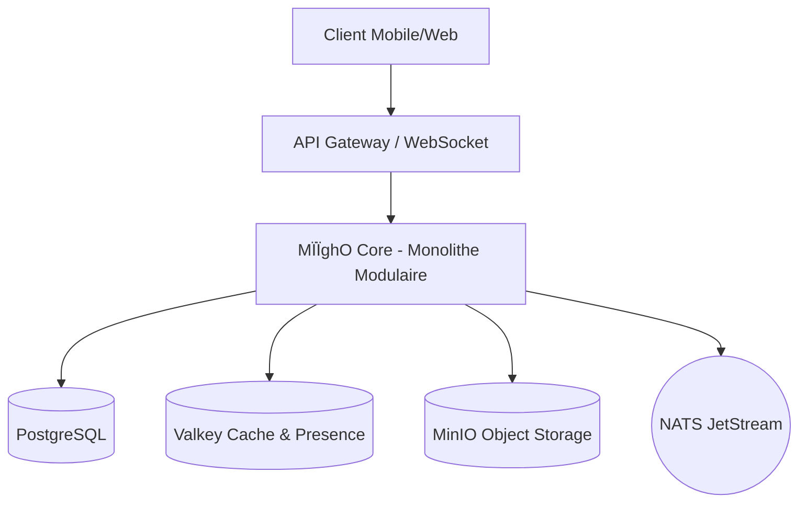
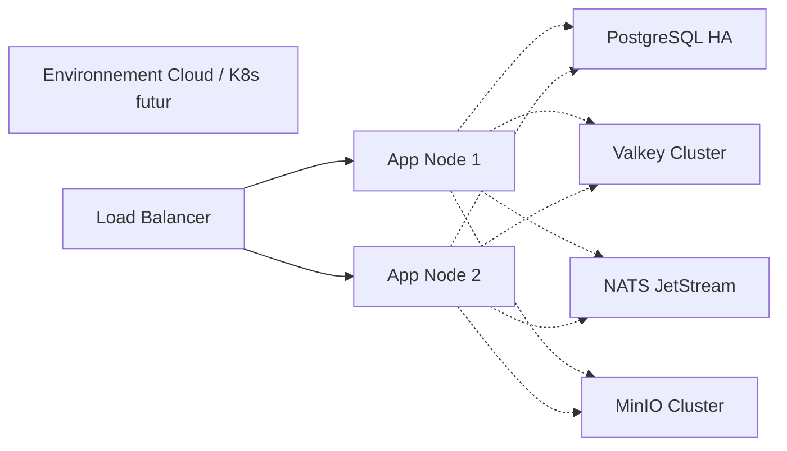

# Architecture de MÏÏghO

Ce document décrit l'architecture technique du projet MÏÏghO, un écosystème numérique panafricain (super-app).

## 1. Vue d'ensemble

L'écosystème MÏÏghO regroupe plusieurs produits (messagerie, paiements, marketplace, cloud, IA) autour d'un modèle d'identité partagé. 

## 2. Architecture logicielle

L'application backend est construite selon le modèle du **Monolithe Modulaire**, basé sur le **Domain-Driven Design (DDD)** et l'**Architecture Hexagonale (Ports et Adaptateurs)**.
Chaque module (Bounded Context) est isolé et définit ses propres modèles de domaine, ses interfaces (ports) et ses implémentations techniques (adaptateurs). Les dépendances se font de l'extérieur vers le domaine (règle de dépendance stricte).

## 3. Bounded Contexts

### Contextes Actuels
- **Auth** : Gestion de l'enregistrement, du login (Téléphone + SMS OTP), et de la gestion des jetons (accès et rafraîchissement).
  - Ports : `UserRepository`, `TokenService`, `OTPProvider`
- **User** : Profils utilisateurs, préférences, présence.
- **Chat** : Conversations, messages, réactions, indicateurs de frappe.
- **Group** : Gestion des groupes, membres, rôles.
- **Media** : Upload, download, transcodage, miniatures.
- **Notification** : Push (FCM/APNs), in-app, badges.
- **Contact** : Synchronisation du carnet d'adresses, recherche, blocage/favoris.

### Contextes Futurs (Définis par Interfaces)
- **Ledger** : Comptabilité en partie double.
- **Wallet** : Abstraction du portefeuille utilisateur.
- **Payment** : Adaptateur de fournisseurs de services de paiement (PSPs).
- **Marketplace, Cloud, AI, DevAPI**.

## 4. Système d'événements

Le bus d'événements asynchrone repose sur **NATS JetStream** pour garantir la livraison (at-least-once).
- **Hiérarchie des sujets** : `miigho.{context}.{event}` (ex: `miigho.user.registered`, `miigho.message.sent`).
- Format : Enveloppes de messages standardisées (ID, Type, Timestamp, Payload, Metadata).
- Groupes de consommateurs : Assurent qu'une seule instance d'un service de traitement traite un événement donné.

## 5. Communication inter-modules

- **Synchrone** : Appels de fonctions in-process via les interfaces publiques définies par les modules. Utilisé pour les opérations critiques et immédiates (ex: validation de token).
- **Asynchrone** : Événements NATS. Utilisé pour le découplage, les notifications, ou les traitements non bloquants (ex: envoi de push après un message).

## 6. Infrastructure réseau

- **API Gateway** : Implémentée avec **Echo**.
- **WebSocket** : Gestion des trames binaires Protobuf pour le temps réel.
- Sécurité : Terminaison TLS 1.3, Rate limiting (Token bucket via Valkey), CORS strict.

## 7. Stockage

- **PostgreSQL (16)** : Source de vérité ACID. Utilise `pgxpool`, des schémas séparés par bounded context, et un partitionnement sur les tables de messages.
- **Valkey** : Stockage en mémoire, sessions, présence. TTL géré par type de clé.
- **MinIO** : Pipeline média, upload/download direct via URL présignées, compatibilité S3.

## 8. Diagramme de déploiement

## 9. Extensibilité

Les nouveaux produits s'intègrent au noyau via le bus d'événements et des adaptateurs d'interface. Le modèle d'identité unique permet aux modules comme Pay ou Market de référencer des utilisateurs globaux sans dupliquer la logique d'authentification.

## 10. Décisions d'architecture (ADR)

1. **Go au lieu de Node.js** : Performance, typage statique, concurrence (goroutines), écosystème mature.
2. **PostgreSQL au lieu de NoSQL pour le MVP** : Transactions ACID cruciales pour les futurs paiements, schéma relationnel fort pour les entités clés.
3. **Valkey au lieu de Redis** : Open-source, hautes performances.
4. **Jetons opaques au lieu de JWT pour les clients** : Possibilité de révoquer immédiatement, sécurité accrue, taille de payload réduite.
5. **Protobuf au lieu de JSON pour WebSocket** : Optimisation de la bande passante pour la connectivité 2G-4G africaine, typage fort des contrats.
6. **Monolithe Modulaire au lieu de Microservices** : Simplicité de déploiement et de test initial, tout en préservant des limites de contexte claires pour un futur découpage.
7. **Framework Echo** : Écosystème riche de middlewares, excellente gestion du routing HTTP et WebSockets.
8. **NATS au lieu de Kafka pour le MVP** : Plus léger à opérer, performances adaptées aux besoins asynchrones actuels, JetStream offre la persistance requise.
