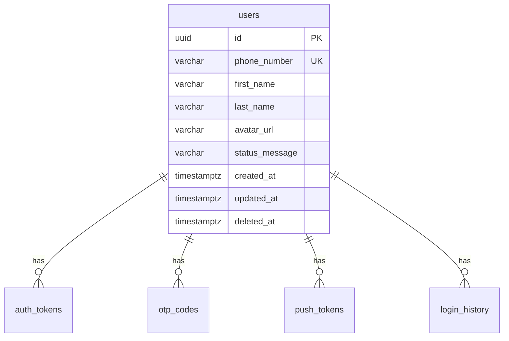
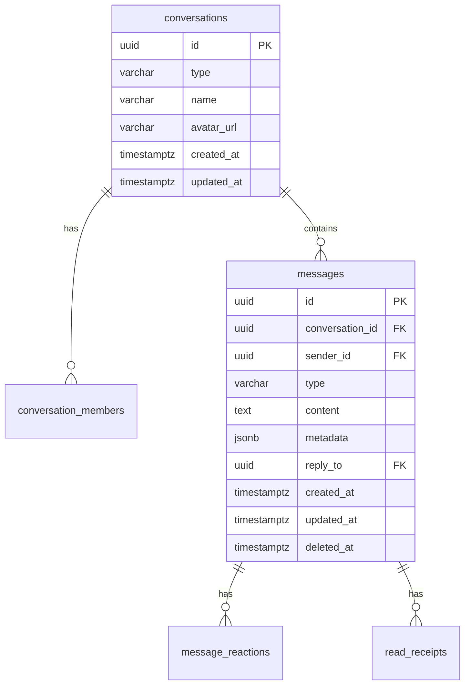
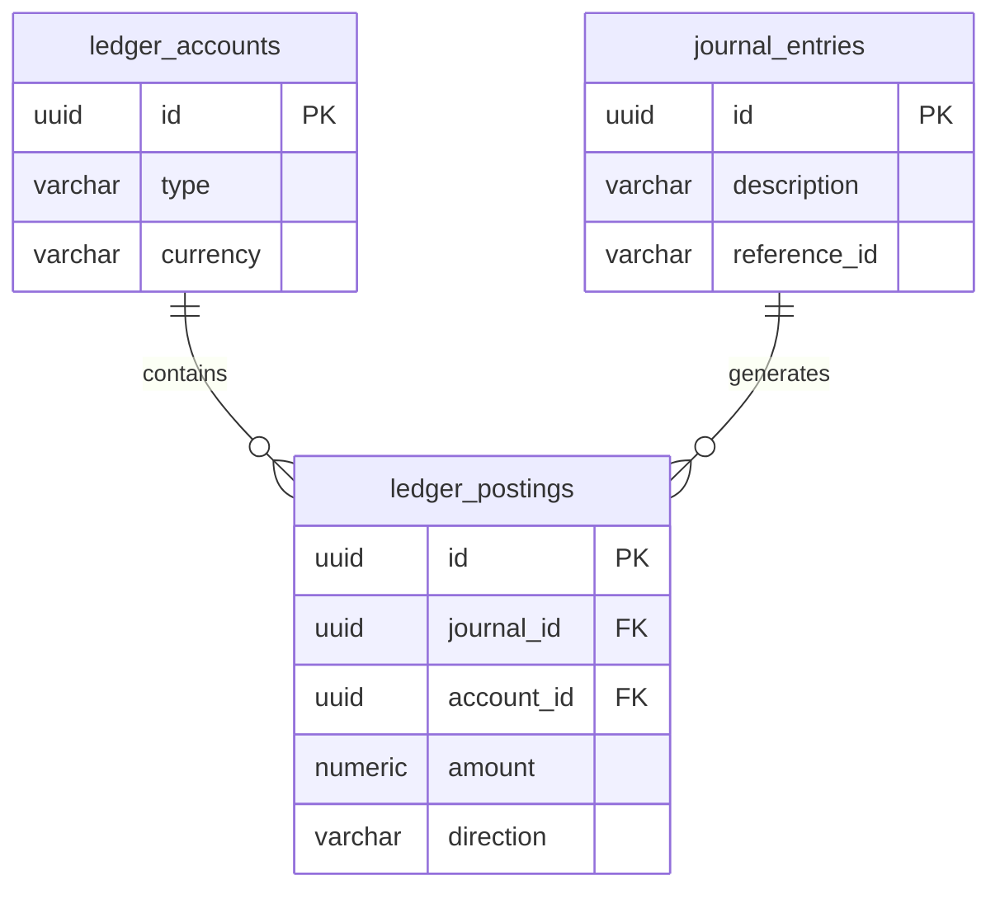

# MÏÏghO : Modèle de Données

Ce document décrit la structure de données fondamentale du backend MÏÏghO, un écosystème digital pan-Africain.

## 1. Principes de conception

- **Clés primaires (PK)** : Utilisation exclusive de **UUIDv7** pour toutes les clés primaires. UUIDv7 offre l'avantage d'être triable dans le temps, ce qui améliore la localité du cache de la base de données et optimise l'insertion.
- **Horodatages** : Utilisation du type `TIMESTAMPTZ` (Timestamp with Timezone) pour tous les champs de date/heure (ex: `created_at`, `updated_at`, `deleted_at`).
- **Soft Deletes** : Une colonne `deleted_at` est utilisée là où la préservation de l'historique ou des relations est critique (ex: utilisateurs, messages).
- **Flexibilité** : Utilisation de `JSONB` pour les métadonnées flexibles, en évitant les colonnes EAV (Entity-Attribute-Value).
- **Partitionnement** : Les tables à fort volume (comme `messages`) sont partitionnées par mois pour faciliter l'archivage, la purge et optimiser les requêtes.

## 2. Schéma par Bounded Context

### Auth & User Context
Gestion de l'identité, des sessions et des profils.

**Tables :**
- `users` : id, phone_number (Unique), first_name, last_name, avatar_url, status_message, created_at, updated_at, deleted_at. Index sur phone_number.
- `auth_tokens` : id, user_id (FK), refresh_token, expires_at, created_at, revoked_at. Index sur refresh_token.
- `otp_codes` : id, phone_number, code_hash, attempts, expires_at, created_at. Index sur phone_number.
- `push_tokens` : id, user_id (FK), device_id, token, platform (android/ios), created_at, updated_at.
- `login_history` : id, user_id (FK), ip_address, user_agent, created_at.

### Chat Context
Messagerie et conversations (privées et groupes).

**Tables :**
- `conversations` : id, type (direct/group), name, avatar_url, created_at, updated_at.
- `conversation_members` : conversation_id (FK), user_id (FK), role (admin/member), joined_at. PK(conversation_id, user_id).
- `messages` (PARTITIONED BY RANGE on created_at) : id, conversation_id, sender_id, type (text, audio, image), content, metadata (JSONB for encryption info), reply_to, created_at, updated_at, deleted_at. Index sur (conversation_id, created_at).
- `message_reactions` : message_id (FK), user_id (FK), emoji, created_at.
- `read_receipts` : message_id (FK), user_id (FK), read_at.

### Contacts Context
Carnet d'adresses et bloquages.

**Tables :**
- `contacts` : user_id (FK), contact_user_id (FK), contact_name, is_favorite, created_at. PK(user_id, contact_user_id).
- `blocked_users` : blocker_id (FK), blocked_id (FK), created_at. PK(blocker_id, blocked_id).

### Media Context
Fichiers attachés et statiques.

**Tables :**
- `media_files` : id, uploader_id, bucket_name, object_name, mime_type, size_bytes, processing_status, metadata (JSONB for variants/thumbnails), created_at.

### Ledger Context (MÏÏghOPay - Future)
Système comptable en partie double (Double-entry accounting).

**Tables :**
- `ledger_accounts` : id, user_id (FK, nullable), type (liability, asset, equity), currency, created_at.
- `journal_entries` : id, description, reference_id, created_at.
- `ledger_postings` : id, journal_id (FK), account_id (FK), amount (NUMERIC), direction (CR/DR), created_at. Constraint: SUM(CR) == SUM(DR) pour un même journal_id (vérifié applicativement ou via trigger).

## 3. Conventions de nommage
- **Tables** : `snake_case` et pluriel (ex: `users`, `conversation_members`).
- **Colonnes** : `snake_case` (ex: `created_at`).
- **Index** : `idx_{table_name}_{column_name}` (ex: `idx_users_phone`).
- **Clés étrangères** : `{table_name}_{column_name}_fkey`.
- **Contraintes** : `chk_{table_name}_{description}` ou `uq_{table_name}_{column}`.

## 4. Stratégie de migration
- L'outil de migration utilisé est `golang-migrate`.
- Tous les scripts doivent avoir une version `.up.sql` et `.down.sql`.
- **Zero-downtime rules** : Ne jamais supprimer une colonne ou renommer une table sans un processus en 3 phases (ajout, double écriture, suppression). Les ajouts d'index doivent utiliser `CREATE INDEX CONCURRENTLY`.

## 5. Stratégie de partitionnement (Messages)
La table `messages` est partitionnée par mois sur la clé `created_at`.
- Un script d'arrière-plan (Cron) créera automatiquement les partitions pour le mois suivant (ex: `messages_y2026m08`).
- Cela garantit des temps de requête constants pour les données récentes et facilite l'archivage dans un stockage froid si nécessaire.

## 6. Considérations de performance
- **Index composites** : `idx_messages_conversation_created` sur `(conversation_id, created_at DESC)` car l'accès aux messages se fait toujours par conversation, trié par le plus récent.
- **JSONB Indexes** : Utilisation d'index GIN si des recherches spécifiques dans `metadata` sont nécessaires (bien que cela soit rare pour le MVP).
- **Connexions** : PgBouncer est utilisé en amont pour gérer le pool de connexions (mode transaction).
