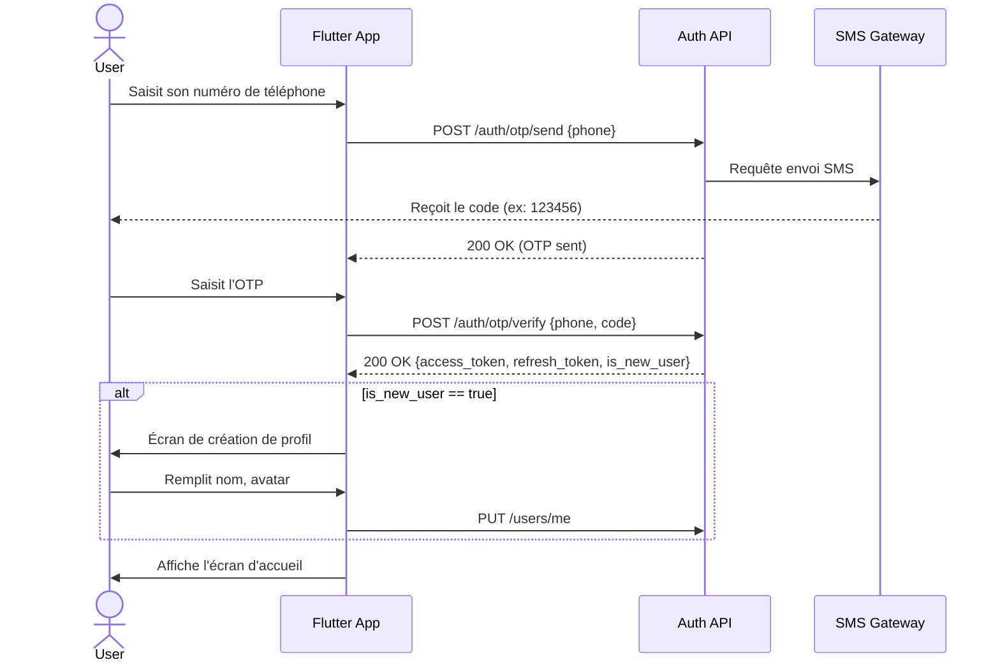
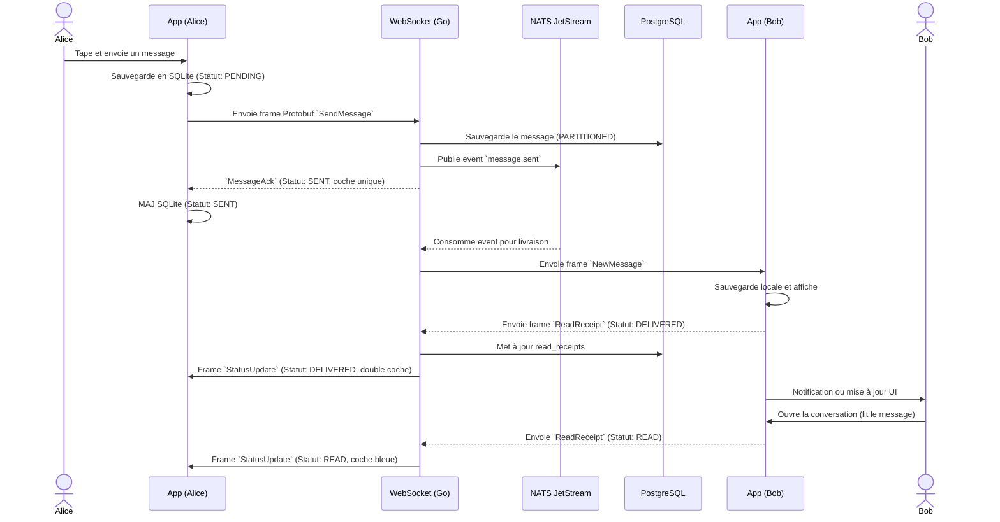
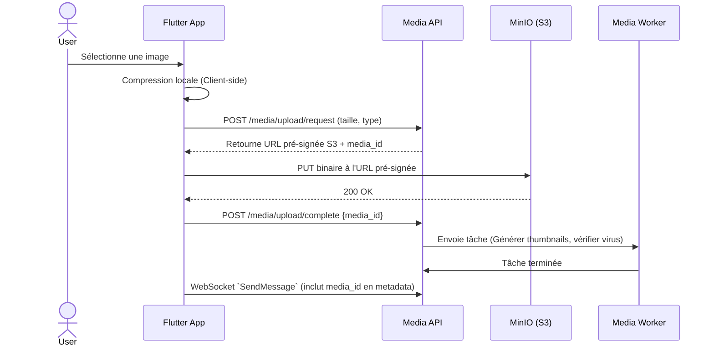
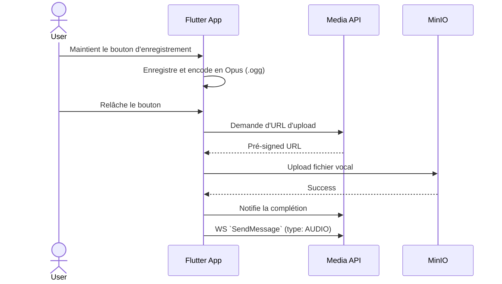
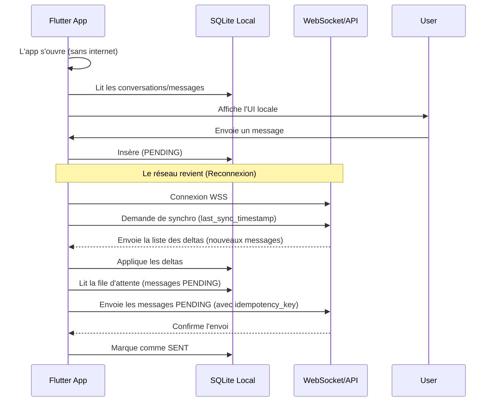
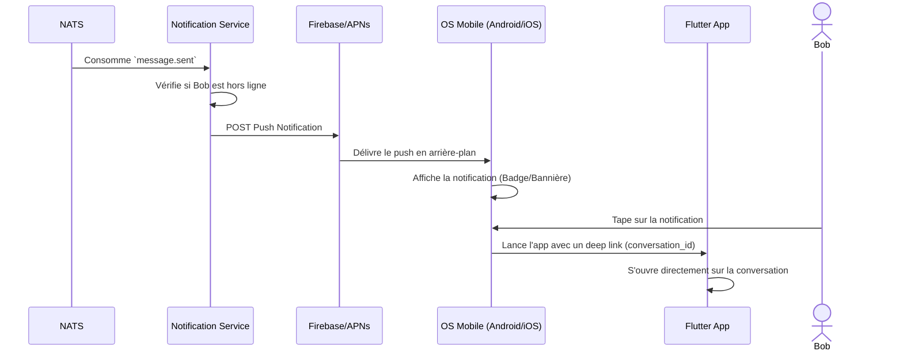
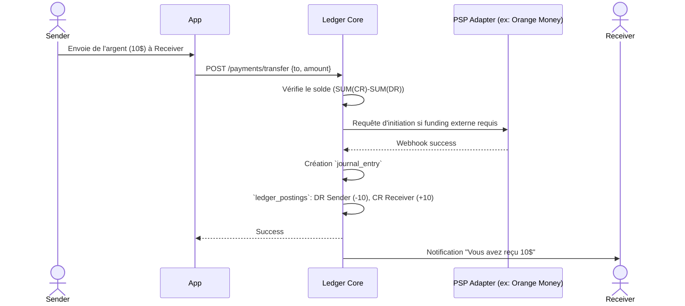
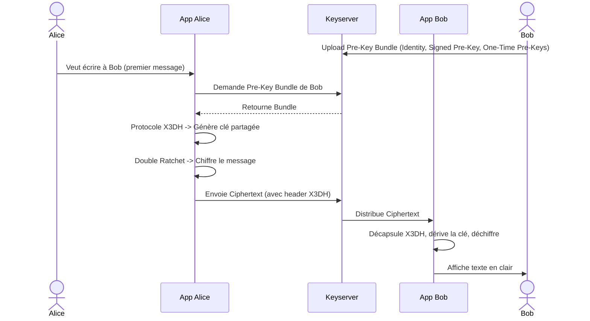

# MÏÏghO : Flux Systèmes et Utilisateurs

Ce document illustre les principaux flux de l'écosystème MÏÏghO via des diagrammes de séquence Mermaid.

## 1. Inscription & Connexion

## 2. Envoi de message texte (Real-time)

## 3. Envoi de média (Image / Vidéo)

## 4. Message Vocal

## 5. Synchronisation Offline

## 6. Réception de Notification Push

## 7. Flux Futur : Paiement P2P (MÏÏghOPay)

## 8. Flux Futur : Chiffrement Bout-en-Bout (Signal Protocol)

